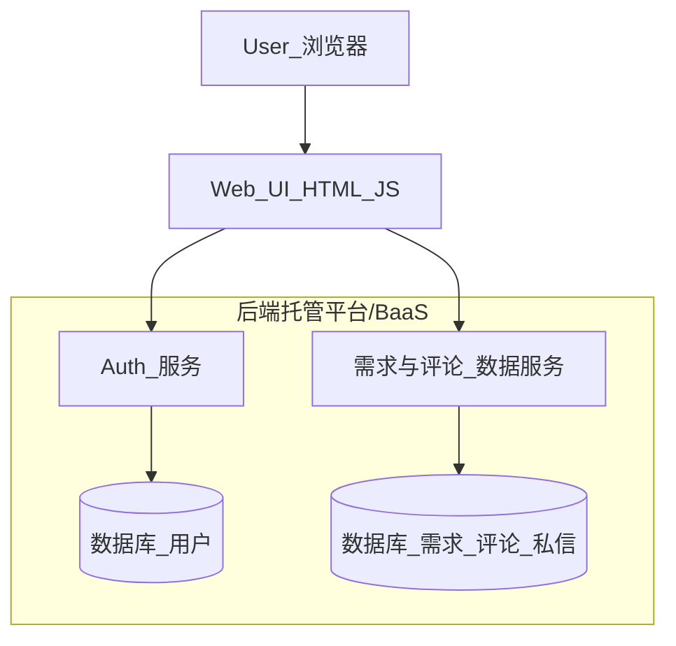

# SAP 顾问需求收集网站 MVP 实施方案

## 目标概述

- **目标**: 搭建一个网站，用于收集中国区 SAP 顾问的需求（来自 QQ 群、微信群等），并按 SAP 模块分类展示；登录用户可以发布需求、评论补充、以及与发布者在站内沟通。
- **人群假设**: 你是没有系统编程背景的个人用户，希望尽量少折腾环境，用最简单方案先跑通一个可用版本。
- **技术策略**: 前端使用你已经在用的 `HTML + CSS + JS` 静态页面风格；数据与登录部分优先使用「托管后端 / BaaS」或「可视化低代码后台」，把复杂度从代码转移到平台。

## 功能范围（MVP）

- **用户体系**
  - 邮箱 + 密码注册 / 登录 / 退出。
  - 基本资料：昵称、擅长模块、工作年限（可选）。
- **SAP 模块与需求管理**
  - 预置常见 SAP 模块列表（如 FI/CO/MM/SD/PP/HR/BW 等），后续可配置扩展。
  - 需求字段：标题、所属模块、需求描述、来源渠道（QQ群/微信群/其他）、期望解决时间、标签（可选）。
  - 需求列表页：按模块过滤、按时间排序、简单搜索（按标题关键字）。
  - 需求详情页：展示完整信息和评论区。
- **互动功能**
  - 评论 / 补充需求（仅登录用户）。
  - 站内私信：在 MVP 阶段简化为「留言箱」模式（给需求发布者发送一条站内消息，收件人在个人中心查看回复），暂不做实时聊天。
- **后台与管理**
  - 管理员登录后台，可查看全部需求与用户，进行基础审核（删帖、封禁用户）。
  - 支持手动从 QQ/微信群整理好的 Excel/表格导入到后台，再由系统统一展示。

## 技术架构设计

- **前端**: 继续使用你现在项目中的结构，例如在 `index.html`、`about.html` 基础上增加新的页面：
  - `sap-demand.html`：需求总览 + 按模块筛选
  - `sap-demand-detail.html`：需求详情 + 评论
  - `login.html` / `register.html`：登录注册
  - `user-center.html`：个人中心 + 私信箱
- **后端**（推荐路线，不在你的本地安装环境）
  - 选用一个支持「账号密码登录 + 数据表 + REST API」的 BaaS/低代码平台（如：腾讯云开发、Supabase、Appwrite、XBase 等等，后续可一起确定一个最适合中国区访问的）。
  - 在平台上配置：
    - 用户表 `users`
    - 模块表 `sap_modules`
    - 需求表 `demands`
    - 评论表 `comments`
    - 私信表 `messages`
  - 前端通过 JavaScript 调用平台提供的 HTTP/JS SDK 接口，无需自建服务器。

## 数据结构草案

- **`users` 用户表**
  - `id` (主键)
  - `email`
  - `password_hash`（由平台负责，不在前端存明文）
  - `nickname`
  - `expertise_modules`（字符串数组或逗号分隔）
  - `years_of_exp`（整数，可选）
  - `created_at`

- **`sap_modules` 模块表**
  - `id`
  - `code`（如 `FI`, `CO`, `MM`）
  - `name_zh`（中文名称）
  - `description`（可选）

- **`demands` 需求表**
  - `id`
  - `title`
  - `module_id`（关联 `sap_modules.id`）
  - `description`
  - `source_channel`（enum：`qq_group` / `wechat_group` / `other`）
  - `created_by`（关联 `users.id`）
  - `expected_time`（可选）
  - `tags`（可选）
  - `status`（如：`open` / `in_progress` / `closed`）
  - `created_at`

- **`comments` 评论表**
  - `id`
  - `demand_id`
  - `user_id`
  - `content`
  - `created_at`

- **`messages` 私信表（留言箱模式）**
  - `id`
  - `sender_id`
  - `receiver_id`（通常是需求发布者）
  - `demand_id`（可选关联）
  - `content`
  - `is_read`
  - `created_at`

## 页面与交互规划

- **1. 首页（扩展现有 `index.html`）**
  - 增加一个入口卡片："SAP 顾问需求广场"，按钮跳转到 `sap-demand.html`。
  - 简短介绍：平台目的、特色（按模块整理、站内沟通、对接 QQ/微信群信息等）。

- **2. 需求广场页 `sap-demand.html`**
  - 顶部模块筛选：FI / CO / MM / SD / PP / HR / BW / 其他。
  - 中间需求列表：每条展示 标题 + 模块 + 来源 + 发布时间 + 评论数。
  - 右上角：
    - 登录状态下："发布新需求" 按钮（弹出/跳转到发布表单）。
    - 未登录：显示 "登录后可发布需求" 提示。

- **3. 发布/编辑需求**
  - 表单字段：标题、模块下拉、来源下拉、描述、标签（可选）。
  - 校验：必填项校验 + 最小字数限制。

- **4. 需求详情页 `sap-demand-detail.html`**
  - 上半部分：需求基本信息。
  - 下半部分：评论列表 + 评论输入框（需登录）。
  - 右侧/底部：
    - "联系发布者" 按钮：打开一个私信弹窗，发送站内消息。

- **5. 登录/注册 `login.html` / `register.html`**
  - 极简风格（Apple 风）：白底 + 少量灰色分割线 + 蓝色主按钮。
  - 注册后自动登录并跳回来源页面。

- **6. 个人中心 `user-center.html`**
  - Tab1：我发布的需求。
  - Tab2：我的评论。
  - Tab3：我的私信（收到/发出）。

## 视觉与交互设计原则

- **Apple 风格原则**
  - 大量留白、简洁排版、少量高饱和色彩（如按钮主色）。
  - 使用系统字体（例如 `-apple-system, BlinkMacSystemFont, 'Segoe UI', sans-serif`），避免复杂花哨字体。
  - 图标统一使用 SVG：
    - 模块图标（如 FI、MM 等）用简单几何图形 + 字母缩写。
    - 操作图标：发布、评论、私信等采用极简线性图标。

- **交互细节**
  - 所有操作按钮在 hover 时有轻微阴影或颜色变化。
  - 表单输入的错误提示清晰但不打扰（红色小字+输入框边框变色）。

## 实施步骤（面向你的操作路径）

- **步骤 1：确认后端托管平台**
  - 我会给出 1–2 个适合中国区访问、支持账号密码登录与数据表的 BaaS/低代码平台建议。
  - 带你一步步在平台上：创建项目 → 创建数据表 → 打开匿名/鉴权规则。

- **步骤 2：在本项目中增加基础页面骨架**
  - 在当前项目根目录下新增页面：
    - `[project_root]/sap-demand.html`
    - `[project_root]/sap-demand-detail.html`
    - `[project_root]/login.html`
    - `[project_root]/register.html`
    - `[project_root]/user-center.html`
  - 提取/复用现有 `index.html` 中的头部导航和基础布局，使风格保持一致。

- **步骤 3：接入后端 SDK / API（仅前端 JS）**
  - 在公共的 JS 文件（例如未来的 `sap-app.js`）中：
    - 初始化后端 SDK。
    - 封装常用函数：`login(email, pwd)`, `register(userData)`, `fetchDemands(filter)`, `createDemand(data)`, `postComment(data)`, `sendMessage(data)` 等。
  - 在各页面通过 `<script>` 调用这些函数，完成页面到数据的打通。

- **步骤 4：实现核心交互流程**
  - 登录/注册流程：表单 → 前端校验 → 调后端 → 本地保存登录状态（如 token 放在 `localStorage`）。
  - 发布需求：登录检查 → 表单提交 → 刷新列表。
  - 评论与私信：登录检查 → 调用对应 API → 在页面上即时更新。

- **步骤 5：基础安全与数据校验**
  - 前端：限制字段长度、防止 XSS（转义用户输入中危险字符）。
  - 后端平台：配置数据库权限，只允许登录用户写入，非作者不能随意删除他人需求等。

- **步骤 6：后续可选升级方向**
  - 微信/QQ 扫码登录。
  - 自动从 QQ/微信群聊天记录中抽取需求（借助机器人或导出文件 + 脚本处理）。
  - 需求状态跟踪（谁接单、解决进度）。
  - 导出报表（按模块、按时间统计需求数量）。